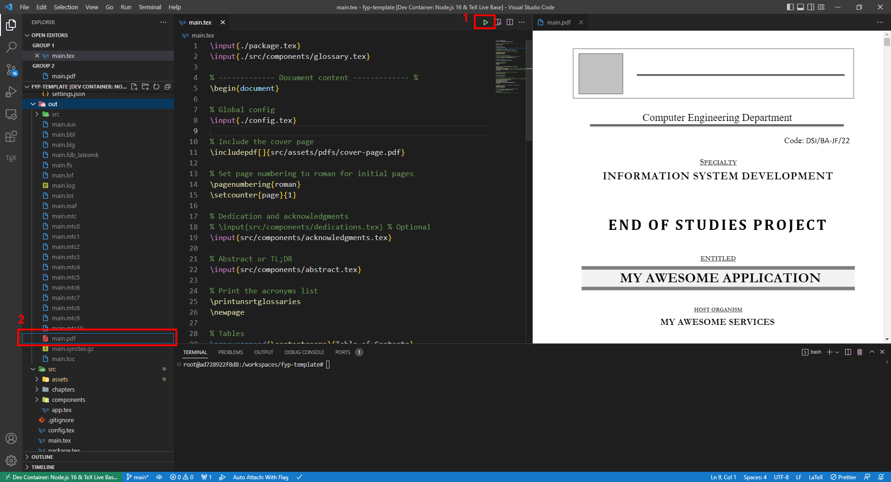

# Final Year Project - Template

## Current Status

aspects are yet to be completed or fixed:

1. **DevOps Section**:
   - The DevOps part is not included as stated in Chapter 5 by the professor.
   - It is actually a continuation of Chapter 4, which is still pending.

2. **Detailed Design**:
   - The detailed design  part is not yet added..

3. **Implementation**:
   - The implementation part is not yet added.

4. **Chapter 3 Fixes**:
   - Chapter 3 is still not fixed and requires further work.

5. **SVG Integration**:
   - SVG has not been implemented.

6. **References and Indexes**:
   - The References and Indexes sections are not yet included.

7. **Glossary Page**:
   - The Glossary page is not added.

This is a starter TeX template with a [development container](https://docs.github.com/en/codespaces/setting-up-your-project-for-codespaces/introduction-to-dev-containers) that can be run directly inside Docker.

That way, you don't have to deal with the dependency hell of configuring and compiling TeX, nor use third party tools that make you leave your editor.

## Getting Started

Assuming you're using VSCode or codespaces

1. You need to get the [Dev Containers extension](https://marketplace.visualstudio.com/items?itemName=ms-vscode-remote.remote-containers)

2. Show the command pallete (default shortcut is <kbd>Ctrl</kbd> + <kbd>SHIFT</kbd> + <kbd>P</kbd>) and run
   > Dev Containers: Open Folder in Container...

Depending on your internet speed, the build will take some minutes...

3. After the dev container is opened, you can know do a build and open the compiled [out/main.pdf](out/main.pdf) to the side. You can do that in a number of ways, the easiest is by doing a `Save`. Here's a picture example.

## Navigation Tips

- Go from `PDF` to code: <kbd>CTRL</kbd>+<kbd>click</kbd>
- Go from code to `PDF` with:
  > LaTeX Workshop: SyncTex from cursor

### **Helpers & References:**

- [Word Counter Tool](https://string-functions.com/wordcount.aspx)
- [Original repo](https://github.com/usersina/isetn-end-of-studies-project)
- https://www.overleaf.com/project/6213ba5a4d9e9a0b44ea27e0
- https://www.overleaf.com/learn/latex/Bibtex_bibliography_styles#Table_of_stylename_values
